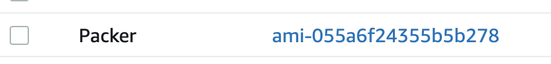
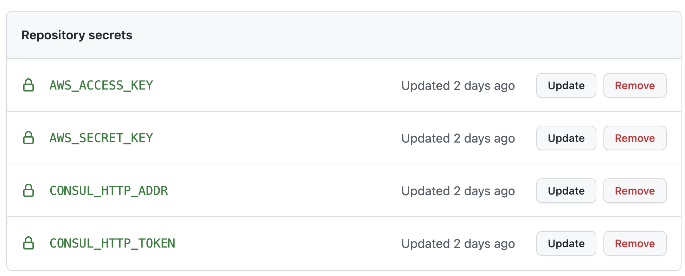
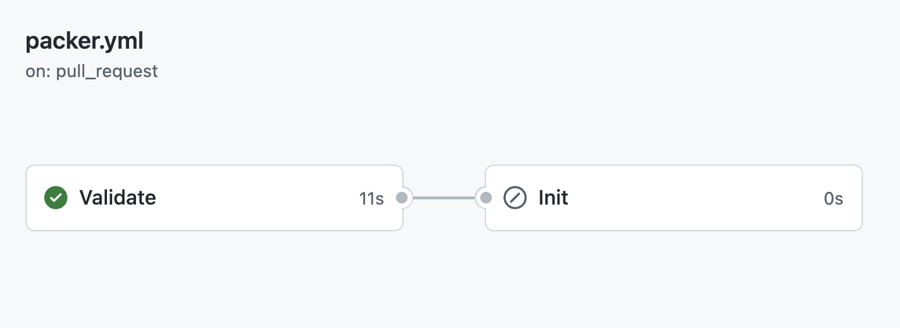
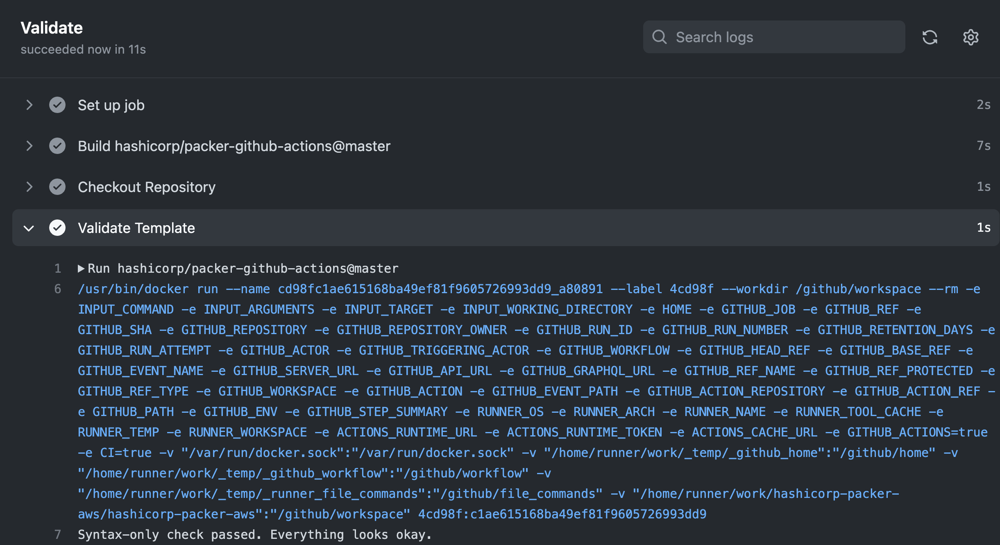
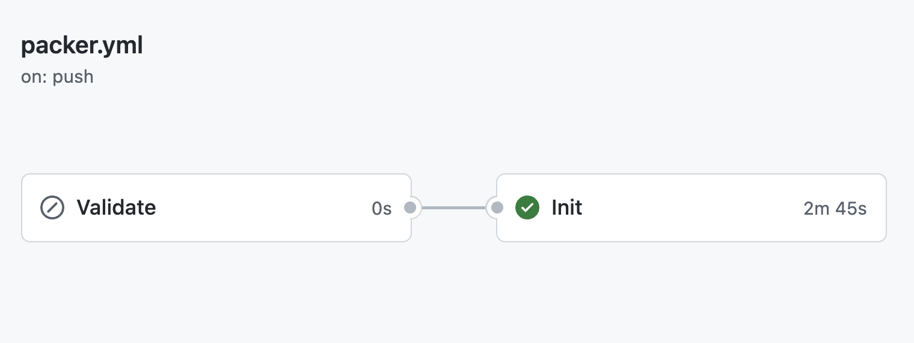
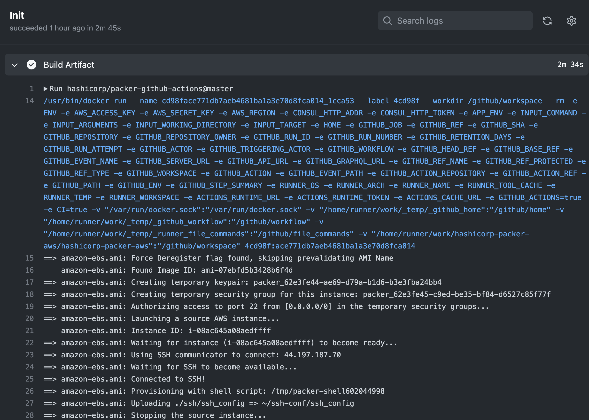

<p align="center" style="text-align:left;">
  <a href="https://www.packer.io">
    
  </a>
</p>

Packer is a tool for building identical machine images for multiple platforms
from a single source configuration.

Packer is lightweight, runs on every major operating system, and is highly
performant, creating machine images for multiple platforms in parallel. Packer
comes out of the box with support for many platforms, the full list of which can
be found at https://www.packer.io/docs/builders.

Support for other platforms can be added via plugins.

The images that Packer creates can easily be turned into
[Vagrant](http://www.vagrantup.com) boxes.

## About this implementation

This repository, has the implementation of **Hashicorp Packer** with **GitHub Actions**, you can read more about this on official web page https://www.packer.io and https://github.com/features/actions

## Building Options

To execute this locally, you need to install Packer o your environment, you can find the official documentation [here](https://learn.hashicorp.com/tutorials/packer/get-started-install-cli)

After installation proccess, you are available to execute locally with this initial commando to validate your packer file, on my case i use Packer with HCL2 (More information about this implementation [here](https://www.packer.io/guides/hcl))

We'll use this HCL2 file to start up with our demo, with [Shell Provisioner](https://www.packer.io/docs/provisioners/shell) and [File Provisioner](https://www.packer.io/docs/provisioners/file)

```
variable "aws_access_key" {
  type    = string
  default = "${env("AWS_ACCESS_KEY")}"
}

variable "aws_secret_key" {
  type    = string
  default = "${env("AWS_SECRET_KEY")}"
}

variable "region" {
  type    = string
  default = "${env("AWS_REGION")}"
}

variable "app_env" {
  type    = string
  default = "${env("APP_ENV")}"
}

variable "version" {
  type    = string
  default = "${env("VERSION")}"
}

variable "consul_http_addr" {
  type    = string
  default = "${env("CONSUL_HTTP_ADDR")}"
}

variable "consul_http_token" {
  type    = string
  default = "${env("CONSUL_HTTP_TOKEN")}"
}

locals {
  ami_name      = "${consul_key(join("/",["polymathes/temporal",var.app_env,"packer/ami-name"]))}"
  ssh_username  = "${consul_key("polymathes/temporal/packer/ssh-username")}"
  source_ami    = "${consul_key("polymathes/temporal/packer/source-ami")}"
  instance_type = "${consul_key("polymathes/temporal/packer/instance-type")}"
}

source "amazon-ebs" "ami" {
  access_key            = "${var.aws_access_key}"
  ami_name              = join("-",[local.ami_name,var.version])
  force_delete_snapshot = true
  instance_type         = "${local.instance_type}"
  region                = "${var.region}"
  secret_key            = "${var.aws_secret_key}"
  source_ami            = "${local.source_ami}"
  ssh_username          = "${local.ssh_username}"
  tags = {
    Name        = "${local.ami_name}"
    Environment = "${var.app_env}"
  }
}

build {
  sources = ["source.amazon-ebs.ami"]

  provisioner "shell" {
    inline = ["mkdir ~/ssh-conf"]
  }

  provisioner "file" {
    source      = "./ssh/ssh_config"
    destination = "~/ssh-conf/ssh_config"
  }
}

```

We'll start validating our **Packer Files**

```
packer validate -syntax-only packer.json.pkr.hcl
```

Our output, if everything was fine will be

```
Syntax-only check passed. Everything looks okay.
```

To execute completly this locally, you must setting up the environment variables need to execute this properly

```
export AWS_ACCESS_KEY=
export AWS_SECRET_KEY=
export AWS_REGION=
export CONSUL_HTTP_ADDR=
export CONSUL_HTTP_TOKEN=
export APP_ENV=
```

| Name | Description | Required |
|------|--------|---------|
|AWS_ACCESS_KEY|**AWS ACCESS KEY** generated with IAM on AWS Console | yes |
|AWS_SECRET_KEY|**AWS SECRET KEY** generated with IAM on AWS Console | yes |
|AWS_REGION|**REGION** used for the AMI | yes |
|CONSUL_HTTP_ADDR|**CONSUL_HTTP_ADDR** used for store KV and **Packer consul_key function**, more information [here](https://www.consul.io/commands#environment-variables) | yes |
|CONSUL_HTTP_TOKEN|**CONSUL_HTTP_TOKEN** used for store KV and **Packer consul_key function**, more information [here](https://www.consul.io/commands#environment-variables) | yes |

For more information about Packer consul_key function, please [here](https://www.packer.io/docs/templates/hcl_templates/functions/contextual/consul)

After this variable definition, we can execute the command ``packer build`` (more information about this [here](https://www.packer.io/docs/commands/build)), we'll use for this example this extra arguments ```-color=false -on-error=abort -force```

```
packer build -color=false -on-error=abort -force packer.json.pkr.hcl
```

The expected output, will be like this

```
==> amazon-ebs.ami: Force Deregister flag found, skipping prevalidating AMI Name
    amazon-ebs.ami: Found Image ID: ami-07ebfd5b3428b6f4d
==> amazon-ebs.ami: Creating temporary keypair: packer_62e3f838-a111-ea42-28c6-b7e0a10f4d00
==> amazon-ebs.ami: Creating temporary security group for this instance: packer_62e3f849-7af3-42d5-5533-0dca0f6a174c
==> amazon-ebs.ami: Authorizing access to port 22 from [0.0.0.0/0] in the temporary security groups...
==> amazon-ebs.ami: Launching a source AWS instance...
    amazon-ebs.ami: Instance ID: i-05effdcbda4b9dca4
==> amazon-ebs.ami: Waiting for instance (i-05effdcbda4b9dca4) to become ready...
==> amazon-ebs.ami: Using SSH communicator to connect: 44.204.218.161
==> amazon-ebs.ami: Waiting for SSH to become available...
==> amazon-ebs.ami: Connected to SSH!
==> amazon-ebs.ami: Provisioning with shell script: /var/folders/ld/q8ckg5_96f1c7xj6mpxwqjs40000gp/T/packer-shell2006054652
==> amazon-ebs.ami: Uploading ./ssh/ssh_config => ~/ssh-conf/ssh_config
    amazon-ebs.ami: ssh_config 1.59 KiB / 1.59 KiB [=======================================================] 100.00% 0s
==> amazon-ebs.ami: Stopping the source instance...
    amazon-ebs.ami: Stopping instance
==> amazon-ebs.ami: Waiting for the instance to stop...
==> amazon-ebs.ami: Creating AMI Packer- from instance i-05effdcbda4b9dca4
    amazon-ebs.ami: AMI: ami-07a223a4bdb6d88cb
==> amazon-ebs.ami: Waiting for AMI to become ready...
==> amazon-ebs.ami: Skipping Enable AMI deprecation...
==> amazon-ebs.ami: Adding tags to AMI (ami-07a223a4bdb6d88cb)...
==> amazon-ebs.ami: Tagging snapshot: snap-0acce3966eea1b81f
==> amazon-ebs.ami: Creating AMI tags
    amazon-ebs.ami: Adding tag: "Environment": ""
    amazon-ebs.ami: Adding tag: "Name": "Packer"
==> amazon-ebs.ami: Creating snapshot tags
==> amazon-ebs.ami: Terminating the source AWS instance...
==> amazon-ebs.ami: Cleaning up any extra volumes...
==> amazon-ebs.ami: No volumes to clean up, skipping
==> amazon-ebs.ami: Deleting temporary security group...
==> amazon-ebs.ami: Deleting temporary keypair...
Build 'amazon-ebs.ami' finished after 4 minutes 58 seconds.

==> Wait completed after 4 minutes 58 seconds

==> Builds finished. The artifacts of successful builds are:
--> amazon-ebs.ami: AMIs were created:
us-east-1: ami-07a223a4bdb6d88cb
```

After this successfully output, you can check on your AWS Console your Custom AMI on **EC2 > Images > AMI**

<p align="center" style="text-align:left;">
  <a href="https://www.packer.io">
    
  </a>
</p>


To do the same in an apropiate Continous Integration process, we choose **GitHub Actions**, so we define that packer validate just execute on **Pull Request** proccess. To enable this option, we describe our action in the next way, defining a expression ```github.event_name == 'pull_request'```(More information about this option [here](https://docs.github.com/en/actions/learn-github-actions/expressions))

```
jobs:
  Validate:
    if: github.event_name == 'pull_request'
    runs-on: ubuntu-latest
    name: Validate
    steps:
      - name: Checkout Repository
        uses: actions/checkout@v2

      - name: Validate Template
        uses: hashicorp/packer-github-actions@master
        with:
          command: validate
          arguments: -syntax-only
          target: packer.json.pkr.hcl
```
 After that, we need to define our variables on [Github Secrets](https://docs.github.com/es/rest/actions/secrets)


<p align="center" style="text-align:left;">
  <a href="https://www.packer.io">
    
  </a>
</p>

Our environment Value ```ÀPP_ENV``` will come from the GithubAction Pipeline, definden by the **branch**

```
- name: Setup ENV
        shell: bash
        run: |-
          if [ ${{ github.event_name }} == "pull_request" ]; then 
            branch=$(echo ${{ github.base_ref }}  | tr / -)
          else 
            branch=$(echo ${GITHUB_REF#refs/heads/} | tr / -)
          fi
          if [ $branch = "master" ]; then 
            env="production";
          elif [ $branch = "develop" ]; then 
            env="develop";
          elif [ $branch = "staging" ]; then 
            env="staging";
          else 
            echo "invalid environment"; exit -1
          fi
          echo "ENV=$(echo $env)" >> $GITHUB_ENV
```

After the creation of a new branch ```git checkout -b feat/new-branch``` and the push a pull request, you'll see this on your **Github Action**

<p align="center" style="text-align:left;">
  <a href="https://www.packer.io">
    
  </a>
</p>

<p align="center" style="text-align:left;">
  <a href="https://www.packer.io">
    
  </a>
</p>

After the merge, you'll see  this on your **Github Action**

<p align="center" style="text-align:left;">
  <a href="https://www.packer.io">
    
  </a>
</p>

<p align="center" style="text-align:left;">
  <a href="https://www.packer.io">
    
  </a>
</p>

After this successfully output, you can check on your AWS Console your Custom AMI on **EC2 > Images > AMI**

<p align="center" style="text-align:left;">
  <a href="https://www.packer.io">
    
  </a>
</p>

### Contributing

I'm grateful to the community for contributing bugfixes and improvements!